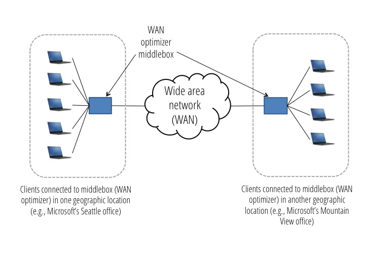
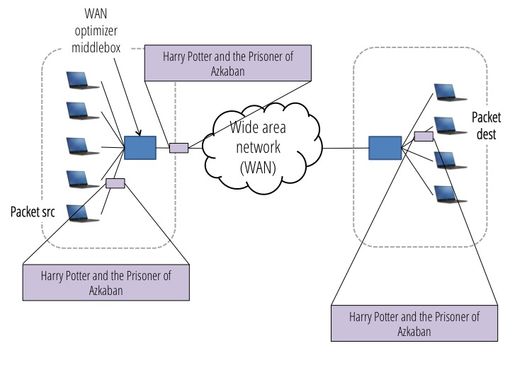
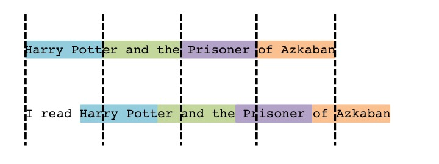
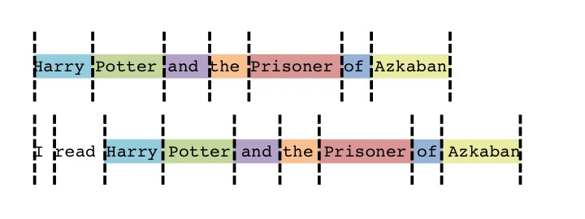
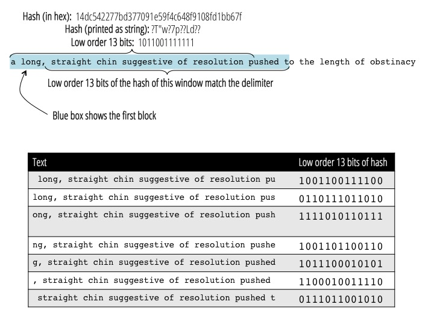

# Wan Optimizer

In this assignment, you'll build a middlebox application that optimizes the amount of data transmitted over a wide area network (WAN). The sending and receiving clients will be unaware of the middleboxes that do the optimizations.

#### Background

Enterprises often have multiple locations that they're sending data between, which are connected by a network that the enterprise pays to use. For example, Microsoft has an office in Seattle, and has another office in Mountain View.  Microsoft pays for internet service from its internet service provider (ISP) (e.g., ATT) to connect the two locations.  Employees at the two offices are likely to send significant data back and forth, and Microsoft has to pay its ISP based on the amount of data transferred.

Enterprises often use WAN optimizers to minimize the amount of data that they have to pay the ISP to transport. A WAN optimizer sits in between clients in one location (e.g., employees in Microsoft's Seattle office) and the wide area network.  At other office locations, e.g., in Mountain View, another WAN optimizer sits between the wide area network and hosts at that location:

WAN optimizers reduce the amount of data sent in various ways.  For this assignment, you'll implement WAN optimizers that remember what data has been sent previously, and use this information to avoid re-sending the same data (more about exactly how to do this is detailed below).  For simplicity, you can assume that each WAN optimizer is only connected to one remote WAN optimizer (but in practice, each WAN optimizer could be connected to multiple different WAN optimizers, all at different locations).

A WAN Optimizer is a concrete example of a middlebox application that violates the end-to-end principle, but because of the substantial benefits it provides, it has become a common occurance in the network. Companies like Riverbed and Blue Coat specialize in providing propriatary WAN Optimizer solutions to enterprise customers. You'll be building a simplified version of solutions that such companies provide.

## Part 1

The first part of the assignment will help you get started with some middlebox functionality by implementing simple data de-duplication.  For this part of the assignment, you should fill in the `receive` method if the `WanOptimizer` class defined in `simple_wan_optimizer.py`.

To understand the functionality you should implement in part 1, let's walk through a simple example.  Suppose the following data is sent over the network:

    Harry Potter and the Prisoner of Azkaban 
    
The diagram below shows the original data traveling across the network. The purple boxes show the packet at different locations as it traverses the network, and the expanded version of each packet shows the payload of the packet.

    
Here, the payload of the packet is the same as the packet travels through the network.  Now, suppose that the same data is sent again.  The idea of the first WAN optimizer is to keep track of blocks of data that have already been sent, and associate each block with a key.  For example, the WAN optimizer might keep track of 10-character blocks (each block is shown with its associated key, and with quotes around it, to make it easier to see spaces):

    0: "Harry Pott"
    1: "er and the"
    2: " Prisoner "
    3: "of Azkaban"
    
Now, if the WAN optimizer sees the same sentence again, instead of sending the sentence, the WAN optimizer could just sent the (shorter) keys:
 
     0, 1, 2, 3
     
  The WAN optimizer on the other side of the WAN, on receiving these keys, would replace them with the complete data before forwarding the packet(s) on to the destination.  The diagram below shows the data that will be sent over the network:
  

Note that the clients are oblivious to the WAN optimizers: from the client's perspective, they're sending and receiving the same data as they would be if the WAN optimizer didn't exist.

There are a few key questions to address:

#### How does a WAN optimizer know whether a packet contains data, or a key that should be translated to data?

Many protocols make use of the FLAGS field in the TCP header for purposes like this.  For this assignment, the Packet class has a boolean `is_raw_data` flag that your WAN optimizer should use to determine whether a packet has data (if the flag is true) or if the packet contains a key that should be translated to raw data by the receiving WAN optimizer.  Clients always send data with this flag set to true; the flag is only set to false when a key is sent between two WAN optimizers.

#### How does each WAN optimizer know how to translate between keys and actual data?

The simple example above used the order of data to translate between keys and actual data: the first 10 characters had key 0, the second 10 characters had key 1, and so on.  For this assignment, you'll instead use a hash.  The WAN optimizer that sends data will compute the hash of each block of data before sending it, and store a mapping between the hash and the raw data.  The receiving WAN optimizer, when it gets raw data, will similarly compute the hash, and store the mapping between the hash and the raw data.  Hashes are convenient because they allow both WAN optimizers to compute the same key for the same data, without actually sending the keys between the two WAN optimizers.  If the same data is sent again later, the sending WAN optimizer sends just the hash, with `is_raw_data` set to false.  Since the receiving WAN optimizer had previously received the corresponding raw data, it will have the hash (and corresponding original data) stored, and can use the stored values to replace the hash with the raw data before sending the packet on to the client. The `utils.py` file has a function you can use to compute the hash.

One important difference from the example above is that, when your WAN optimizer sends a hash, it should send just one hash per packet (for brevity, the example above showed all of the keys sent in a single packet).

#### What size should packets be?

For all communication the packet size should be less than or equal to `utils.MAX_PACKET_SIZE` (1500 bytes).

#### How should data be split into blocks?

Determinig how to split data into blocks is the key challenge of implementing a WAN optimizer.  In this project, you'll implement two different approaches, one for each part of the project.  For the first part, you'll split data into fixed size blocks that are of size 8 kilobytes (this constant is defined in `simple_wan_optimizer.py`).  Because the maximum packet size is only 1500 bytes, you will need to buffer packets in your WAN optimizer in order to create 8 kilobyte blocks.  You should buffer as little as possible, and you should *not* wait for a fin packet to split the data in a flow into blocks.  For example, suppose your WAN optimizer that's connected to a sending client first receives 3 maximum-sized packets:

    Packet 0: 1500 bytes
    Packet 1: 1500 bytes
    Packet 2: 1500 bytes
    
At this point, the WAN optimizer should not send any data over the WAN, because it hasn't yet received a complete block, so doesn't know whether the raw data needs to be sent or if there's a match in the cache of blocks that have already been sent.  Now suppose you receive 3 more packets:

    Packet 3: 1500 bytes
    Packet 4: 1500 bytes
    Packet 5: 1500 bytes
    
At this point, the WAN optimizer has received 9000 bytes, so enough to send one block.  The WAN optimizer should send either a hash (if the first 8000 bytes have been sent previously) or the 8000 bytes of raw data, and should buffer the remaining 1000 bytes until it receives the remaining 7000 bytes for the 2nd block.

#### Why break data into blocks?

You may be wondering why data should be broken into blocks instead of, for example, just using the payload of each packet.  The reason for using a specific block size is that the same data may be broken into different packets when it's resent.  For example, for the example payload above:
 
     Harry Potter and the Prisoner of Azkaban 
        
   All of the text might be first sent as the payload in a single packet.  The next time it's sent, it might be split up into two packets, the first of which contains:

    Harry Potter and the 
      
and the second of which has the rest:
  
    Prisoner of Azkaban 
    
Using a fixed block size helps guard against data that's split into different packets.  Note that even if a host is always sending packets of the same size, packets may be fragmented in the network.  Also, keep in mind that even a single stream of data may have multiple blocks that are the same.

#### What happens when a stream of data ends and a full block of data hasn't been sent?

Data streams will often end in places that are not on a block boundary.  For instance, in the example above, if Packet 5 were the last packet (i.e., had `is_fin` set), the last 1000 bytes don't make up a complete block. In this case, you should just store a hash for the remaining smaller block.

#### What assumptions can I make about the stream of packets?

You can assume all packets arrive in-order, and that there's no packet loss.

#### Should all of the tests pass for my part 1 WAN optimizer?

Yes.  You'll notice that the implementation provided in `simple_wan_optimizer.py` forwards packets without any data reduction, and if you run the tests with the provided code, all but 3 of the tests will pass.  This is because the remaining tests check for correctness, and may fail as you implement the WAN optimizer functionality.

## Part 2

For this part of the assignment, you should fill in the `receive` method of the `WanOptimizer` class defined in `lbfs_wan_optimizer.py`.

While the approach in part 1 works well if exactly the same file is sent repeatedly, it doesn't work well if the contents of the data sent change even slightly.  For example, if a prefix is added to the data that's sent, it's likely that none of the blocks will match, even though most of the data is the same as data sent before.  To see an example of this, consider the short text example from part 1, where "Harry Potter and the Prisoner of Azkaban" was broken into 4 10-byte blocks.  Now, if the same text is sent again with "I read " appended to the beginning, the new blocks will all be different from the old blocks.  The original text is shown on top of the below diagram, and each colored box represents one of the blocks in the original text. The dashed lines show the 10-byte boundaries where data is split into blocks.  In the second (bottom) text, where "I read " is appended to the beginning, all of the text has been shifted such that none of the blocks from the original text will match the data between the dashed lines in the new text.

Prefixes are not the only issue: it's also possible for sent data to change in other ways.  For example, some text might be added in the middle of a stream of data.

To address this issue, at a high level, you'll use the same algorithm in part 2 as in part 1.  You'll break data into blocks, and if a WAN optimizer needs to send a block that it's already sent before, it will send the hash rather than the raw data.  However, for this part, you'll use a more sophisticated way of breaking data into blocks that is more robust to small changes in the data.  Before reading the algorithm below, can you think of any ideas for better ways of breaking data into blocks?

It may be helpful to first think about how you might break data into blocks if you knew the WAN optimizer would always be sending textual data.  One way to break textual data into blocks is to treat each word as a block (i.e., a block ends when there's a space).  Treating each word as a block makes the division of data into blocks robust to small changes in the data.  If new words are added at the beginning or in the middle of the file, the new blocks will need to be sent as raw data, but all of the other words can be sent as hashes rather than sending the raw data.  For example, the example below shows how this approach would work with the example text:

Here, the original text is broken into the following blocks (shown as different colors above):

    0: "Harry "
    1: "Potter "
    2: "and  "
    3: "the "
    4: "Prisoner "
    5: "of "
    6: "Azkaban"
    
When "I read" is added at the beginning, the "I read" will need to be sent as raw data, and 2 new blocks will be saved:

    7: "I "
    8: "read "

But the remainder of the text is broken into the same blocks as the original data, so can be sent using the keys (in this example, 0, 1, 2, 3, 4, 5, 6) rather than the raw data.

Of course, a middlebox needs to handle other types of data than raw text, so you can't use words as blocks (these would also be very small blocks).  But, your WAN optimizer will rely on a similar idea, where you look for certain _delimiters_ in the text, and use these delimiters to determine where blocks start and end.  As in the words-as-blocks algorithm, using a delimiter to determine where blocks start and end will result in variable sized blocks.

#### How do I break file into blocks using a delimiter?

In the toy example above, we used spaces as a delimiter.  Unfortunately, for middleboxes, it's too brittle to use a delimiter in the raw data.  For example, while a space (so each block is a word) or period (so each block is a sentence) might work well for textual data, spaces and periods might be rare or non-existent in other types of data streams.

Instead, you'll look for a delimiter in the *hash* of the data.  Hashing the data effectively randomizes it, so that if you pick __any__ set of bits as the delimiter (e.g., 0110), that delimiter it is expected to appear regularly in hashes of the data.

You should compute the hash over 48 byte sliding windows in the raw data.  Each time you hash a 48 byte window, you should compare the low-order 13 **bits** of the hash to `GLOBAL_MATCH_BITSTRING` (a delimiter we've defined for you in `lbfs_wan_optimizer.py`).  If the low order 13 bits match, this is considered the end of the block.  The 48 bytes that the hash was computed over should be included in the current block, and then the current block should end.  The next block should start at the next byte.

You should use a __sliding__ window that slides at a granularity of 1 byte.  So, you should compute the hash over the first 48 bytes, and if the low order 13 bits of the hash did __not__ match the delimiter, then you should slide the window forward by one byte, and then re-compute the hash (so the current window will overlap with 47 bytes of the previous window).  The figure below shows an example:

The text near the top, "a long, straight chin suggestive of resolution pushed to the length of obstinacy", represents a stream of data that's passing through the middlebox.  At the top of the figure, the hash and low order bits of the hash for the first 48 bytes of the text is shown (you can print the hash in hex with `"".join(a.encode("hex") for a in block_hash)`).  The table at the bottom shows the next 7 48-byte pieces of the text as the window slides forward, and the low order 13 bits of the hash for each of those pieces of text.  The last hash in the table matches the delimiter, so the first block will be all of the text up to and including those bytes: "a long, straight chin suggestive of resolution pushed t".

Because there are fewer than 48 bytes in the remainder of the stream (assuming a fin is sent after the last word above), your WAN optimizer shouldn't compute any more hashes, because there are no more 48 byte windows to compute a hash over, and the last bytes should be a stored as one block: "o the length of obstinacy".

This example text is used in the `send-multiple-different-blocks` test, which may be useful for debugging your code.

#### How big will each block be?

The size of each block will be variable. If data is random, the average block size should be 2^13 bytes = 8 Kilobytes. Because the window size is 48 bytes, blocks should only be shorter than 48 bytes when the end of the stream is reached (e.g., in the example text shown above).

#### How do I get the lower order 13 bits of the hash?

The `utils.py` has a function you can use to get the last n bits of any string (remember that the low order 13 bits are the last 13 bits).

#### What size should packets be?

As in part 1, for all communication the packet size should be less than or equal to the maximum packet size (1500 bytes).

#### What happens when a stream of data ends where there isn't a delimiter?

As in part 1, data streams will often end when there isn't a delimiter to mark the ending.  You should end a block whenever you see a delimiter __or__ the end of the stream is reached (as in part 1).

#### Why is the file I fill in for this part called `lbfs_wan_optimizer.py`?

The algorithm you're using in this assignment is based on a paper called "A **L**ow-**b**andwidth Network **F**ile **S**ystem", hence the "lbfs" in the name.  You're welcome to read that paper if you'd like more background on this idea!
